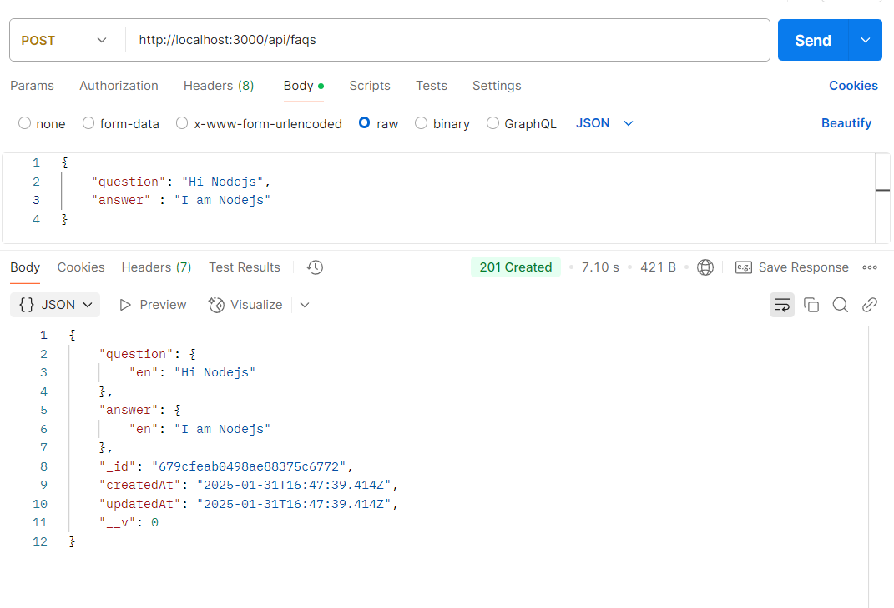
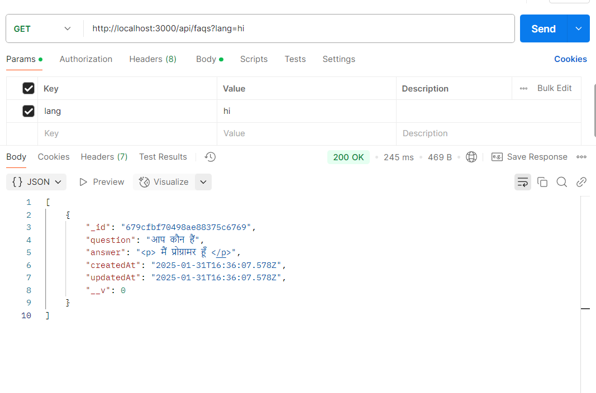
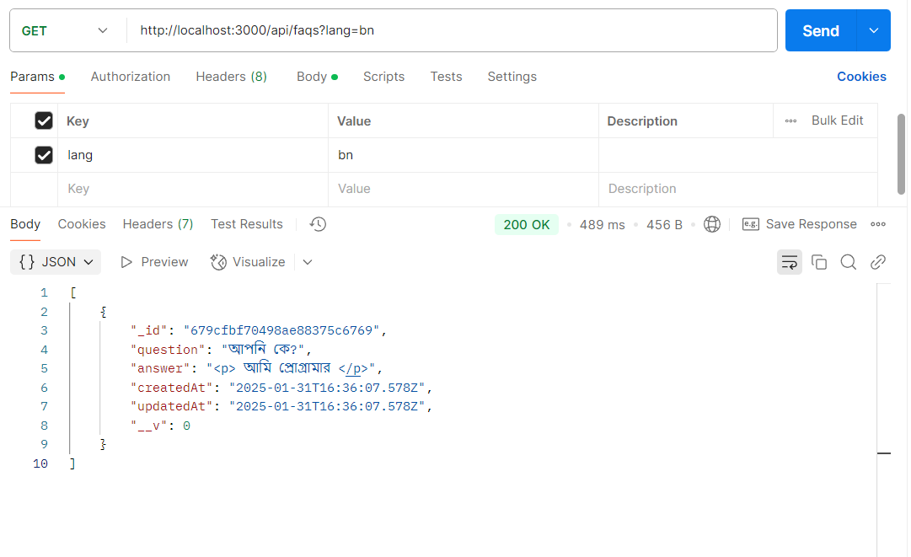
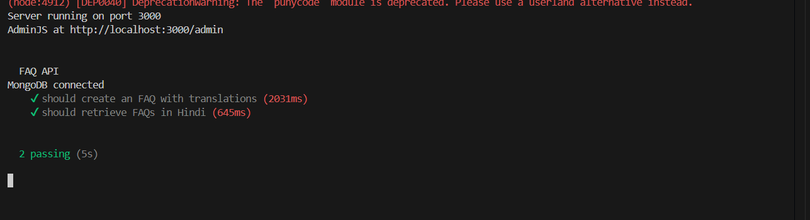
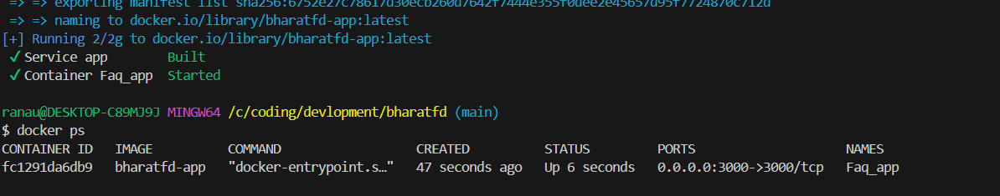
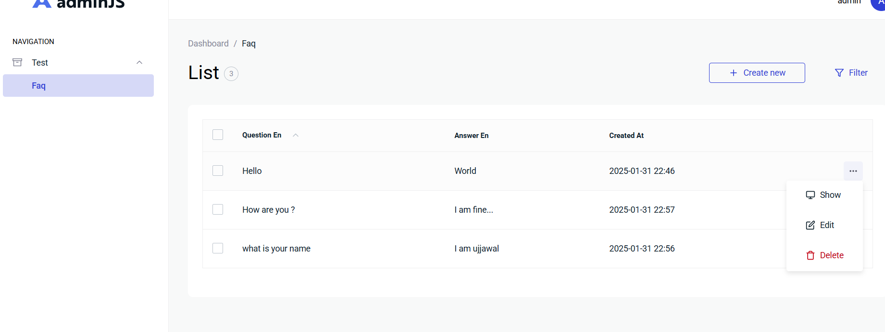

# FAQ Backend Project

This project is a backend application for managing FAQs (Frequently Asked Questions) with support for **multi-language translations** (English, Hindi, Bengali). It uses **Node.js**, **Express**, **MongoDB**, and **Redis** for caching. The Admin Panel, built with **AdminJS**, allows easy management of FAQs, including auto-translation of content.

---

## Features

- **Multi-language Support**: FAQs are stored in English, with auto-translation to Hindi and Bengali.
- **Admin Panel**: Add, edit, and delete FAQs with a user-friendly interface.
- **Caching**: Redis is used to cache FAQs for faster retrieval.
- **REST API**: Fetch FAQs in different languages using query parameters.
- **Unit Tests**: Comprehensive tests for API endpoints and translation logic.

---

## Technologies Used

- **Backend**: Node.js, Express
- **Database**: MongoDB
- **Caching**: Redis
- **Admin Panel**: AdminJS
- **Translation**: Google Translate API
- **Testing**: Mocha, Chai, Supertest

---

## Project Structure
```
├── admin/  # AdminJS configuration
│ └── admin.js # AdminJS configuration
├── controllers # API controllers
│ └── faqControllers.js # FAQ API controller
├── models/ # Database models
│ └── faqModel.js # FAQ schema
├── routes/ # API routes
│ └── faqRoute.js # FAQ routes
├── services/ # Services used
│ └── translate.js # Translation service
├── test/ # Unit tests
│ ├── faq.test.js # FAQ API tests
├── utils/ # Config files
│ └── db.js # MongoDb and RedisClient Connection Logic
├── index.js # Express app initialization
├── docker-compose.yml # Docker Compose configuration
├── Dockerfile # Docker configuration
├── package.json # Project dependencies
├── README.md # Project documentation
```


---

## Setup Instructions

### Prerequisites

1. **Node.js**: Install Node.js (v16 or higher) from [nodejs.org](https://nodejs.org/).
2. **MongoDB**: Install MongoDB locally or use a cloud service like MongoDB Atlas.
3. **Redis**: Install Redis locally or use a cloud service like Redis Labs.
4. **Docker** (optional): Install Docker for containerized deployment.

---

### Step 1: Clone the Repository

```bash
git clone https://github.com/Ranaujjawal/BharatFD_backend_assignment.git
cd BharatFD_backend_assignment
```
### Step 2: Install Dependencies
- Install the required Node.js packages:

```bash
npm install
```
### Step 3: Set Up Environment Variables
- Create a .env file in the root directory and add the following variables:
``` bash
MONGODB_URI= your-mongourl
REDIS_URL= your-redis-url
ADMINJS_COOKIE_SECRET=supersecret
PORT=3000 or any as you like
```
### Step 4: Start MongoDB and Redis
- MongoDB: Start MongoDB locally or use a cloud connection string.
- Redis: Start Redis locally or use a cloud connection string.

## Step 5: Run the Application
- Start the server:

```bash
npm start
```
- Open your browser and navigate to [http://localhost:3000](http://localhost:300)

### Step 6: Access the Admin Panel
- Open your browser and go to [http://localhost:3000/admin](http://localhost:3000/admin)
- Log in with the following credentials: 
- default hardcoded values are used store secreactly in a keyvault like Azurekeyvault or any other container
```
Email: admin 
Password: password
```

## API Endpoints
### Fetch FAQs
- Default (English):
GET /api/faqs response is like:
```json
{
        "_id": "679d05628c65d17798e56bce",
        "question": "Hello",
        "answer": "World",
        "createdAt": "2025-01-31T17:16:18.167Z",
        "updatedAt": "2025-01-31T17:16:18.167Z",
        "__v": 0
    }
```

- Hindi:  reponse is like:
GET /api/faqs?lang=hi
```json
 {
        "_id": "679d05628c65d17798e56bce",
        "question": "नमस्ते",
        "answer": "दुनिया",
        "createdAt": "2025-01-31T17:16:18.167Z",
        "updatedAt": "2025-01-31T17:16:18.167Z",
        "__v": 0
    }
```

- Bengali: response is like:
GET /api/faqs?lang=bn
```json
{
        "_id": "679d05628c65d17798e56bce",
        "question": "আমি উজ্জাওয়াল",
       "answer": "<p> আমি উজ্জাওয়াল </p>",
        "createdAt": "2025-01-31T17:16:18.167Z",
        "updatedAt": "2025-01-31T17:16:18.167Z",
        "__v": 0
    }
```

### Add FAQ
POST /api/faqs
Request Body:

```json
{
  "question":  "What is Node.js?" ,
  "answer":   "Node.js is a runtime environment." 
}
```
### Running Tests
- To run the unit tests:

```bash
npm test
```
- Result



## Build the Docker Image
Run the following command to build the Docker image for the application:

```bash
docker-compose up --build -d
```



## Go to Admin Portal
- To access the admin portal, go to http://localhost:3001/
- Login with the following credentials: username: admin, password: admin



## Thank You